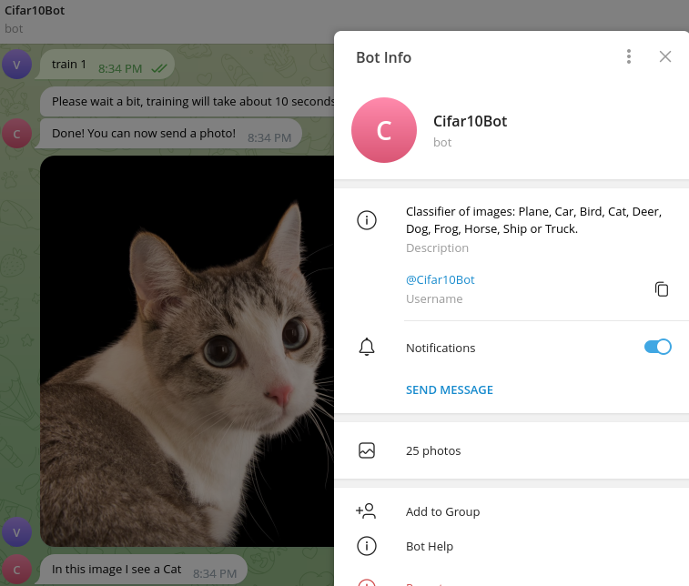

# Telegram Bot

<b>I'm Cifar10Bot.</b>
You can type messages and I will respond to them.
For example you can ask me current time by typing 'time'.

<b>I can classify images.</b>
You can send me an image with
Plane, Car, Bird, Cat, Deer, Dog, Frog, Horse, Ship or Truck on it.
And I will say, what I see on the image.
I'm not too good at guessing,
because I work with low-quality images.

<b>How to train me:</b>
If you want to make me better at classifying, type 'train X',
where X is a number of epochs you want me to train.
You can use /reset command to remove learning progress.



Бот запущен на сервере, чтобы его использовать, напишите
```
@Cifar10Bot
```
в телеграмме. Также можно (но не рекомендуется, иначе бот будет запущен с двух компьютеров одновременно, и могут возникнуть ошибки) установить и запустить локально. Для этого следуйте инструкции:

## Установка:
```
git clone git@github.com:VasVol/telegram_bot.git
cd telegram_bot
git checkout dev
python3 -m venv venv
source venv/bin/activate
pip install -r requirements.txt
```

## Запуск:
```
python3 main.py
```
